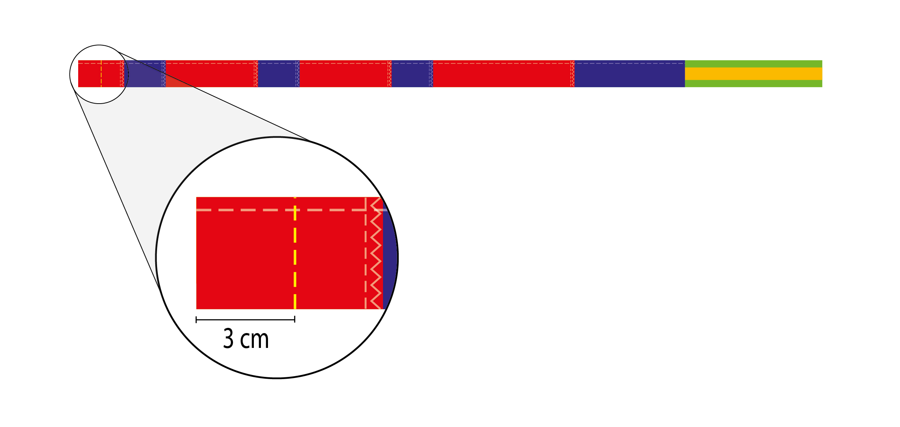

# Список матеріалів
* Чорна стрічка-липучка шириною 3,5-3,85 см для лицьової сторони ременя, складається із жорсткої (hook) і м'якої (loop) частин.
* Біла стрічка-липучка шириною 2 см для кліпси, жорстка і м'яка частини.
* Бавовняно-поліестерова тасьма шириною 3,5-3,85 см і товщиною приблизно 1,5 мм для тильної сторони ременя.
* Міцна нерозтяжна нейлонова тасьма шириною 2,5 см і товщиною приблизно 1,3 мм для внутрішнього ременя.
* Двосторонні заклепки з головкою 7 мм.
* Поліестрова нитка товщиною 0,75 мм для зшивання деталей пояса.
* Клей щоб прикріпити стрічку-липучку до кліпси. Ціаноакрилатний клей (Суперклей) для деталей, надрукованих ABS-пластиком, або двокомпонентна епоксидна смола для деталей із пластику PETG.
* Надруковані пластикові деталі.

# інструкція по складанню:
1. Відріжте ремені необхідної довжини, а саме:
 * Чорна стрічка-липучка (жорстка стрічка: 3 шт. по 6 см і 1 шт. 15 см, м'яка стрічка: 1 шт. 6 см, 2 шт. 12,5 см кожна, 1 шт. 19 см)
 * Біла стрічка-липучка (жорстка стрічка: 1 шт. 20 см, м'яка стрічка: 1 шт. 20 см)
 * Бавовняно-поліестерова тасьма (Polyester Cotton Webbing) - 97 см
 * Нерозтяжна нейлонова тасьма (Nylon Heavy Webbing) - 97 см

2. Щоб сформувати лицьову сторону ременя, пришийте підготовлені вами чорні стрічки (липучки) один до одного в наступній послідовності: 6 см м'яка стрічка, 6 см жорстка стрічка, 12,5 см м'яка стрічка, 6 см жорстка стрічка, 12,5 см м'яка стрічка, 6 см жорстка стрічка, 19 см м'яка стрічка, 15 см жорстка стрічка. Важливо щоб кожен наступний елемент підкладався під попередній. Прошийте кожне сполучення двома проходами для збільшення міцності на розрив. Зробіть другий шов зигзагоподібним. Це розрівняє місце перекриття і полегшить проходження ременя через отвір в пряжці.

3. Лицьова сторона ременя коротша за тильну (бавовняно-поліестерова тасьма). Вирівняйте лицьову і тильну сторону так, щоб на спільному кінці ременя була м'яка стрічка довжиною 6 см. Зшийте лицьову сторону ременя з тильною по всій довжині з одного боку. Залиште інший бік відкритим, щоб вставити внутрішній ремінь. 

4. Вставте внутрішній ремінь між лицьовим та тильним, а потім зшийте кінець внутрішнього ременя з зовнішніми ременями наступним чином:
  * Вирівняйте кінці внутрішнього та зовнішніх ременів
  * Внутрішній ремінь має знаходитись по центру відносно зовнішніх ременів

  * Прострочить всі три ремені (на всю ширину зовнішніх ременів) на відстані 3 см від краю

  * Прострочить навхрест зовнішні ремені з 3ого до 5ого сантиметру від краю

5. Закруглить зшитий кінець ременя. Зшийте лицьову частину ременя із тильною з іншого боку, так щоб внутрішній ремінь міг вільно рухатися всередині.

6. Виконайте два отвори по краях з іншої сторони лицьового ременя.

7. Використовуючи заклепки, закріпіть опорну пластину на ремені через зроблені отвори. Внутрішній ремінь має вільно рухатися всередині

8. З заокругленого кінця протягніть ремінь через отвори кліпси, поки він не досягне опорної пластини. Зауважте, що кліпса має бути повернута вузькою стороною до опорної пластини, як зображено на фотографії.

9. Вставте внутрішній ремінь через отвір в ручці ворота. Потім Протягніть внутрішній і тильний ремені через проріз опорної  пластини.

10. Після встановлення ручки ворота, послабте трохи натяг внутрішнього ременя. Так, щоб можна було зробити пів оберту ручки ворота до того, як турнікет почне затягуватися.

11. Пропустіть кінці внутрішнього і тильного ременів через беззубчастий отвір пряжки та пришийте пряжку так, як зображено на фотографії. Ремені мають бути зшиті кількома подвійними швами, відстань від пряжки до опорної пластини має скласти приблизно 3 см. Напис на пряжці має бути з лицьової сторони ременя.

12. Видаліть усі зайві нитки.

13. Прошийте заокруглений кінець ременя, щоб його було легко вставити в пряжку.

14. Застебніть білу стрічку-липучку зсунувши жорстку стрічку відносно м'якої приблизно на половину довжини. Зшийте жорстку і м'яку половинки на кінці жорсткої стрічки.

15. Приклейте суперклеєм м'яку стрічку до кліпси. жорстка стрічка має залишитись вільною, щоб нею можна було огорнути кліпсу зверху і написати на ній час накладання турнікету.

Зверніть увагу:  якщо є така можливість, то замість того щоб зшивати лицьову сторону ременя з жорстких і м'яких відрізків звичайної стрічки-липучки, можна застосувати один цільний відрізок стрічки типу omni tape. Стрічка типу omni tape прилипає сама до себе, тому що вона одразу поєднує в собі елементи жорсткої та м'якої стрічок на одній і тій самій стороні (саме на одній стороні, а не м'яка частина з однієї сторони, а жорстка з іншої).

Щоб було простіше зшивати частини стрічки-липучки, можна скористатись малярським скотчем: наклейте всі частини стрічки-липучки на скотч, зшийте частини, а потім відклейте скотч.