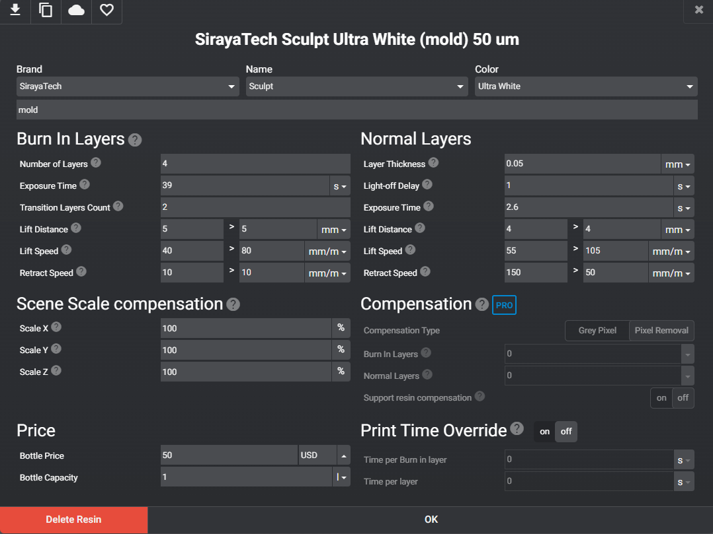
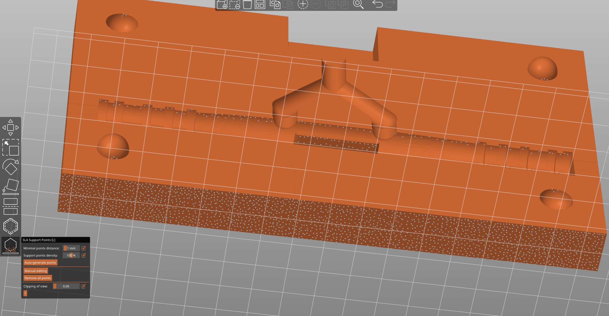

# Desktop injection molding 
This folder details the Glia Poland's experimental desktop injection molding process for the plastic parts of the Glia Tourniquet. It details our journey and any pitfalls we have encountered over the months of working at the project, any tips and tricks and the methodology we have established along the way. Please read through it carefully in its entirety before attempting to injection mold your own tourniquet parts. 

# Files
This folder contains files for prototypical molds for all four parts of the Tourniquet to be printed on a resin 3D printer. Each of the molds height is 10cm and they have a universal slot for the aluminium insert that matches our machine's nozzle. The resin compound that is used for printing is brittle and would not withstand the pressure nor the high temperature of the injection molder nozzle so the part of the mold that directly touches it needs to be made of metal, aluminium being the easiest one to machine out. We have provided a file for the insert under the name of "nozzle_slot.FCStd". The nozzle block is split in the middle - when milling you need to put two 2cmx3cmx1cm thick blocks in the vice. 

### Aluminium molds
The folder "aluminium_milled" contains edited molds for milling them out of metal on a 3-axis CNC machine. They will require modification to change over the nozzle shape to the machine that you are using. You should aim to create aluminium molds - the resin is great for prototyping and setting up the machine/testing out plastics, but shatters easily and does not permit long runs. An average aluminium mold longevity is between 2000 - 10000 parts, compared to around 10 using the Siraya Tech Ultra White resin. Stronger engineering resins exist which could provide a longer run, but we have not tested them out.

# Our machine
We are using the [Buster Beagle mk3 injection molding machine](https://www.busterbeagle3d.com/) with the SC100 piston. The mk3 has been confirmed to have enough plastic volume to inject the biggest part of the tourniquet - the windlass. Its main drawback is the weak workholding - a 2 ton vice - which we supplement with [C-clamps](https://www.amazon.com/Edward-Tools-Heavy-Steel-Clamp/dp/B086FRTJF4/). Later on we plan to implement an automated pneumatic vice system that will give us more reliable setting times and ease the handling of the process. 

# Our plastic
Initially we injected the parts with ABS pellet. This proved to be difficult to perform with a DIY injection molder and gave us unconsistent results. The amount of [splay](https://en.wikipedia.org/wiki/Splay_(plastics)) and [delamination](https://en.wikipedia.org/wiki/Delamination) made the parts unacceptable and in effect we decided to switch the plastic to [HDPE](https://en.wikipedia.org/wiki/High-density_polyethylene) which has a better melting and flowing abilities.
We suggest using already coloured, virgin pellets which can be obtained from online retailers or local plastic markets. The pellet needs to be injection molding grade and have an MFI (Melt Flow Index) of minimum 8. Natural white pellets may show discoloration in the part if injected at higher temperatures but is generally easier to inject as color additives often make the HDPE absorb moisture from air and moist plastic needs to be dried before injecting. We were unable to color the pellets inside the Buster Beagle chamber by adding powdered pigments or masterbatches when injecting - we ended up with streaky, uneven color resembling a tie-dye effect.

### What about reground?
Recycled plastic can be used, provided it did not absorb moisture and that the injected part does not perform worse than virgin pellets. Another issue is the fact that recycling companies sometimes mix different plastic subtypes together making it very hard to determine the end result and rigidity of the final part. 

# Anything else I need?
### A compressor
You need a car compressor to power the Buster Beagle piston. We previously used [a small 8 bar 20l compressor](https://sklep.kupczyk.pl/kompresor-tlokowy-fl-24-kupczyk,3,19543,2316), but changed to a larger one after a few months. Currently we are using a [10 bar 115l compressor](https://narzedziapremium.pl/produkt/sprezarka-kompresor-olejowy-115l-v-2065-bjc/) as it's work cycles are longer. It has a regulator at the end, and a quick-release, in case we need to use the compressed air to power something else. A bigger compressor is also needed for the further plans of automating the process. Remember to always wear ear protection when working near a compressor device!

### A small oven
There are [cheap, small ovens](https://www.amazon.com/BLACK-DECKER-TO1313SBD-4-Slice-Toaster/dp/B00GGFHH4U/?th=1) that will be used for drying the pellets and for warming up the molds. They cannot substitute a professional dryer, but cost a fraction of the money and help quite a bit. You should be drying everything that goes into the machine, regardless of the pellets used - whether they are recycled or new. Drying helps immensly with humid environments. Make sure the oven you're buying has a "warm" setting - that it goes under 100 degrees C. 
**Do not use your home oven to dry plastic**
An oven will provide parts that still have moisture problems, but are functional. 

### Alternative to small oven: tumbling dryer
**You probably want a seperate dryer for clothes and for plastic - especially if using colored. This will probably dirty up your clothes with plastic and is possibly a health risk.**
A tumbling clothes dryer works better than an oven, resulting in strong parts that only have cosmetic defects. You need a cloth sack, fill it with plastic, tie it off with a ziptie and throw it into a dryer. Make sure the heat is set to low - you probably want to be drying the pellets at around 80 degrees C. 

### Alternative to small oven or tumbling dryer: industrial drying machine
To completely solve the moisture problem, you need to have an industrial grade drying machine. They are rather expensive to get, as of 11.05.2023 costing around 2000 euro netto, with other companies reaching 3000 or 4000. There are two technologies that work - either an air powered dryer from a compressor, or one equipped with molecular sieves. You would want a dew point of around -20 degrees Celsius. 

### Safety Eguipment
Always wear a full face mask with a chemical filter while doing injection molding.
Wear overall safety suit and protective shoes and gloves in your workshop, keep them clean and aside from your regular clothes. This is due to the possibility of the fumes and microplastics contaminating your attire.
Always wear ear protecting mufflers when working near an air compressor running. 

**Full Bill of Materials and safety equipment list along with purchase links are available in a Google Spreadsheet [here](https://docs.google.com/spreadsheets/d/1QdxPsisKP4URstnQ1jl8uQBEAy5sUwtlR8eIOhQ_-8g/edit#gid=0).**

# How do I make a mold?
We are printing our molds in Siraya Tech Ultra White on the Anycubic Photon Mono X 6k. This tutorial assumes you know the basics of resin printing. 
### Safety 
Resin printing is a messy and toxic process, the first steps are to make sure you are safe. Wear nitrile gloves, safety glasses and a respirator or mask. Do not get any of the resin on your skin. Process any trash from the printing by hardening everything using a UV flashlight (wear UV safety glasses when doing this). Do not touch, sniff, throw away uncured parts or supports. Clean any spill with isopropyl alcohol. Have an air purifier with a HEPA filter in your workshop or work in a well ventilated area. [Read safety best practices for resin printing](https://all3dp.com/2/sla-3d-printing-is-3d-printer-resin-toxic/)
### Settings
We are printing with the following settings: 

### Print orientation
We are printing the molds standing up, off the baseplate, on supports. We have tried other orientations that provide a shorter print, but we encountered issues with the peel forces being too great and ruining it. We angle the print away by 2 - 3 degrees, so the supports don not touch the surface, requiring sanding.  

### Presupporting the file
We use two slicers to prepare files for print. We use PrusaSlicer for its autosupport feature and better supports, then we export the plate with supports and slice the file using Lychee. We need to add more supports on the bottom in PrusaSlicer, see a sample density in the pic below. Otherwise the print falls of the plate under the peel forces/its own weight. We tend to oversupport the print to avoid wasting resin in a failure. 

### Tolerances
Some files might require sanding and fitting. You should be able to open the empty molds without any issue / them getting stuck. 

# Which one do I start with?
The easiest part to inject is the buckle. It has a very small and simple mold that does not require too much resin to print. The cavity survives a lot of injections easily, with the core breaking, so you usually have to reprint just one half of the mold if it shatters. 

# What do I do now? 
**Skipping any of these steps usually ends up with the resin mold shattering and being unusable.**

1. You need an [aluminium nozzle slot machined, example from the BusterBeagle site](https://www.busterbeagle3d.com/product/aluminum-injection-mold-sprue/9?cp=true&sa=true&sbp=false&q=false). It is a small runner section milled/drilled in two alu blocks with the shape of the nozzle for your machine. It should fit the opening at the top of the mold (one half is 2cm x 3cm x 1cm). We have provided a file for the nozzle insert for the Buster Beagle mk3. Do not buy the one from the BusterBeagle shop, that one does not fit the molds. 
2. You need a backing for the molds in the vice. The mold cannot be unsupported, it needs something behind it / in front of it. A piece of MDF works great, or a thick aluminium plate. Make sure it covers the entire mold, and is rigid. 
3. You need [C-clamps](https://www.amazon.com/Edward-Tools-Heavy-Steel-Clamp/dp/B086FRTJF4/) to hold down the mold and prevent it from yawing open. The default vise on the bottom of the machine works up to 2 tons. Add two or three C-clamps on the part that is sticking out of the vise and tighten them down. This prevents  flashing or yawing open the mold. 
4. Make sure the total travel of the nozzle head isn't too big. The nozzle should be around a centimeter from the nozzle block on the mold. Having it go for longer causes your injection to fail, and in extreme situations can break your machine. Don't use the entire travel of the springs to do the injection. 
5. You need a [mold release agent](https://rubberpro.eu/store/pl/srodki-antyadhezyjne-teflonowe/263-maclube-1725-srodek-antyadhezyjny-400ml-spray.html). The plastic tends to grip the molds and doesn't let go despite the draft angles in the design. A mold release spray helps with that. 

**Skipping any of these steps usually ends up with the resin mold shattering and being unusable.**

### Injection machine settings
We are injecting at 190 degrees Celsius, at around 7 bar on the compressor using the SC100 cylinder. These settings may change in the future, and are a starting point, not a requirement. Find something that works for you - that does not break the molds and does not burn your plastic. We have the fastest possible injection speed on the valve for the piston. We heat up our molds in the oven at less than 100 degrees Celsius, while drying pellets in it at the same time.
